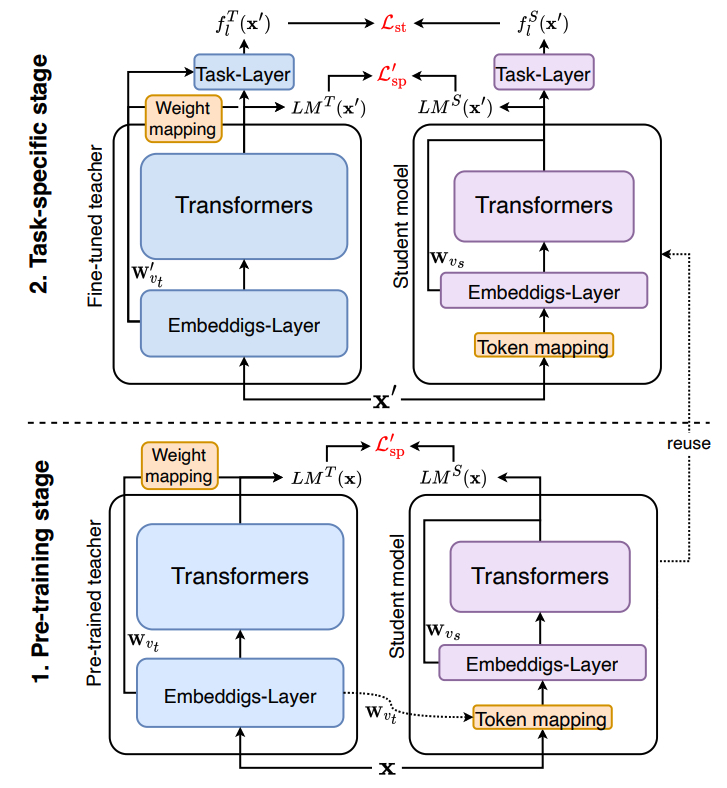


  
You can also find my articles on <a href="{{site.author.googlescholar}}">my Google Scholar profile</a>.



<!-- ### paper title
author list
[code](repo link), [PDF](paper link)

    

        
    

    

        ABS.
    

 -->

## 2023

***

### Are Intermediate Layers and Labels Really Necessary? A General Language Model Distillation Method
Shicheng Tan, Weng Lam Tam, **Yuanchun Wang**, Wenwen Gong, Shu Zhao, Peng Zhang, Jie Tang
[code](https://github.com/aitsc/GLMKD), [PDF](https://aclanthology.org/2023.findings-acl.614.pdf)

    

        
    

    

        A general language model distillation (GLMD) method that performs two-stage word prediction distillation and vocabulary compression, which is simple and surprisingly shows extremely strong performance.
    

<!-- 


  
 -->
